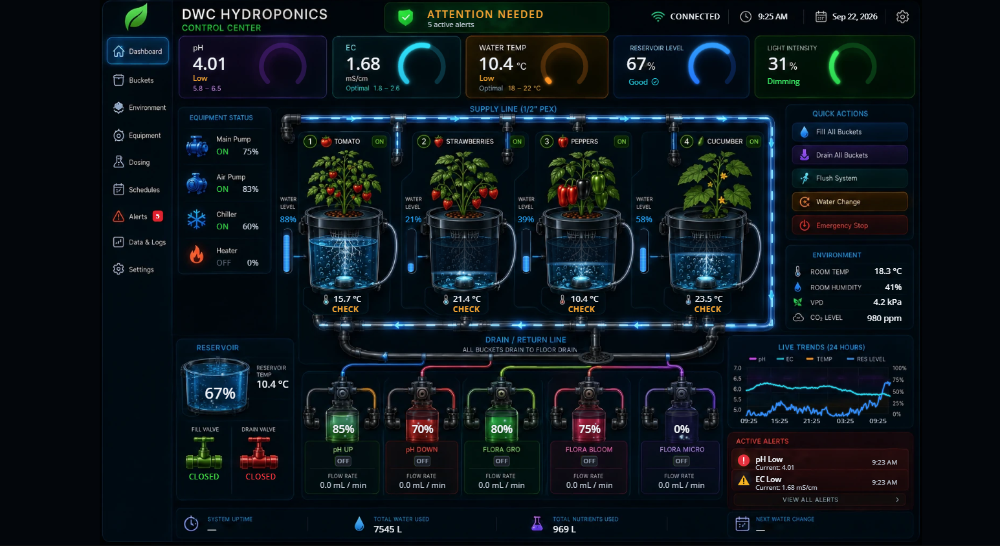

# DWC Control Center — Home Assistant card

An animated control-center dashboard for my basement DWC hydroponics build, running as a
Home Assistant custom card: `custom:dwc-control-center-card`.



The artwork is a rendered image of the system. Everything live is drawn on top of it and comes
straight from Home Assistant:

- **Gauges** — pH, EC, water temperature, reservoir level, light intensity, each with an Optimal /
  Low / High reading from the limits in the config.
- **Buckets** — per-bucket water level (the level bar and the water in the bucket both move),
  water temperature, and a GOOD / CHECK / LOW status.
- **Animation** — bubbles rise from each air stone to the current water surface and stop when the air
  pump is off; water flows through the supply and return lines while the main pump runs; the feed
  line into a bucket flows while that bucket is filling; dosing pumps pulse while they run.
- **Equipment, reservoir and valves** — pump, chiller and heater state, reservoir level and
  temperature, fill/drain valve open or closed.
- **Dosing** — bottle levels and pump state for pH Up, pH Down, Flora Gro, Flora Bloom, Flora Micro.
- **Trends and alerts** — a 24-hour chart pulled from HA history, plus alerts worked out from the
  limits (out-of-range pH or EC, low reservoir, low bucket, low bottle).

## Install

1. Copy **`dwc-control-center-card.js`** and **`bg.webp`** into Home Assistant's
   `www/dwc/` folder (full path `/homeassistant/www/dwc/`, served as `/local/dwc/...`).
2. **Settings → Dashboards → ⋮ → Resources → Add resource**
   URL `/local/dwc/dwc-control-center-card.js?v=1.0.0`, type **JavaScript module**.
3. Add a dashboard with a single **Panel** view holding one card:

```yaml
type: custom:dwc-control-center-card
background: /local/dwc/bg.webp
fit: screen          # screen = whole dashboard fits the screen, width = fill the width
```

Hard-refresh the browser (Ctrl+F5) the first time, and after every update.

## Configure

Every entity the card reads can be set in the card's YAML. The defaults are the `input_number.demo_*`
and `input_boolean.demo_*` test helpers; swap in the real ESPHome entities as the hardware comes online.

```yaml
type: custom:dwc-control-center-card
background: /local/dwc/bg.webp
entities:
  ph: sensor.hydro_ph
  ec: sensor.hydro_ec                 # µS/cm or mS/cm, converted automatically
  waterTemp: sensor.hydro_water_temp
  reservoirLevel: sensor.hydro_reservoir_level
  mainPump: switch.hydro_main_pump
  airPump: switch.hydro_air_pump
  # …also reservoirTemp, light, chiller, heater, fillValve, drainValve,
  #   roomTemp, roomHumidity, vpd, co2, waterUsed, nutrientsUsed,
  #   uptime, nextWaterChange (the last two show "—" until they're set)
buckets:                              # picture order: 1 Tomato, 2 Strawberries, 3 Peppers, 4 Cucumber art
  - { level: sensor.tomato_level,     temp: sensor.tomato_temp,     fill: switch.tomato_fill_valve }
  - { level: sensor.strawberry_level, temp: sensor.strawberry_temp, fill: switch.strawberry_fill_valve }
  - { level: sensor.pepper_level,     temp: sensor.pepper_temp,     fill: switch.pepper_fill_valve }
  - { level: sensor.lettuce_level,    temp: sensor.lettuce_temp,    fill: switch.lettuce_fill_valve }
bottles:                              # pH Up, pH Down, Flora Gro, Flora Bloom, Flora Micro
  - { level: sensor.ph_up_level, pump: switch.dose_ph_up, ml_per_min: 5.0 }
quick_actions:                        # HA scripts the five buttons run; unset = the button says so
  fillAll: script.hydro_fill_all
  drainAll: script.hydro_drain_all
  flush: script.hydro_flush
  waterChange: script.hydro_water_change
  emergencyStop: script.hydro_emergency_stop
limits:
  phMin: 5.8
  phMax: 6.5
  ecMin: 1.8
  ecMax: 2.6
  tempMin: 18
  tempMax: 22
  levelLow: 30
  bottleLow: 15
```

Notes:
- Bucket 4's artwork shows a cucumber; it's wired to the lettuce bucket.
- `ml_per_min` is the flow-rate figure shown under each bottle. Set it to each pump's measured rate.
- Drain All, Water Change and Emergency Stop need a second tap within 4 seconds to confirm.

## Change how it looks

`src/dashboard-source.html` holds the layout, styles and live-value logic, and
`src/ha-card/card.template.js` wraps it as a Home Assistant card. After editing either:

```bash
python3 tools/build_card.py 1.1.0
```

That rewrites `dwc-control-center-card.js`. Copy it to `www/dwc/`, bump `?v=` on the resource to match,
and hard-refresh.

Pixel positions of every overlay on the 1536×1024 artwork are in the `L` (layout) block of
`src/dashboard-source.html`. Only touch those if something sits off its spot.

## Rebuild the artwork

`bg.webp` is the rendered image with its baked-in numbers and gauge arcs erased, so live values can be
drawn in their place. To redo it from a new 1536×1024 image, save it as `src/reference-original.png` and:

```bash
pip install opencv-python-headless numpy
python3 tools/clean_plate.py    # writes src/bg.webp (and src/clean.png to eyeball)
python3 tools/build_card.py 1.1.0
```

The erase boxes and gauge centres in `clean_plate.py` are measured for the current image; a different
image needs them re-measured, along with the `L` block.

## Versions and rolling back

Each working version is tagged, starting at **`v1.0.0`**.

```bash
git add -A
git commit -m "what changed"
git tag v1.1.0
git push && git push --tags
```

If an update misbehaves, get the last good card back:

```bash
git show v1.0.0:dwc-control-center-card.js > dwc-control-center-card.js
```

Copy it to `www/dwc/`, set the resource back to `?v=1.0.0`, and hard-refresh.
